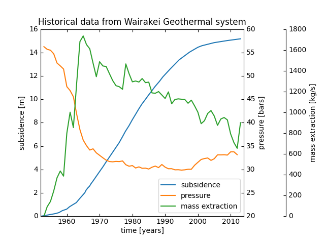
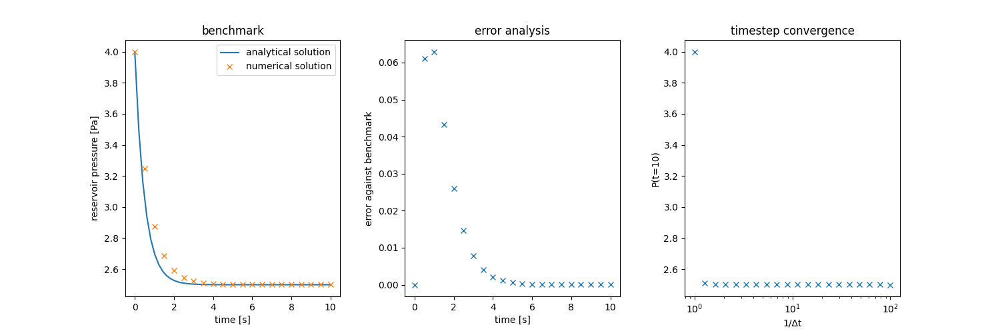
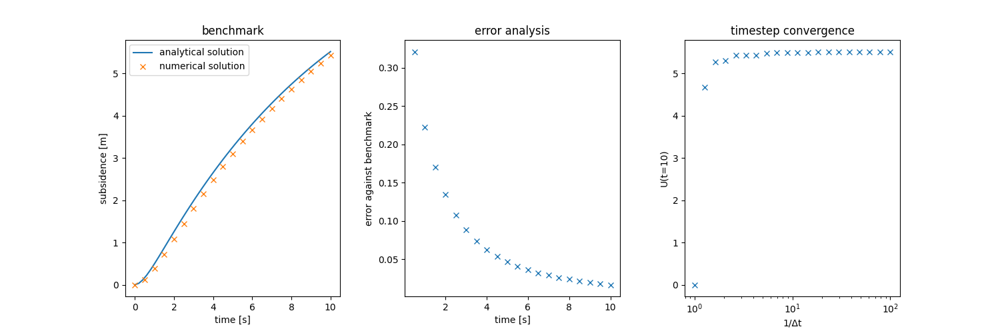
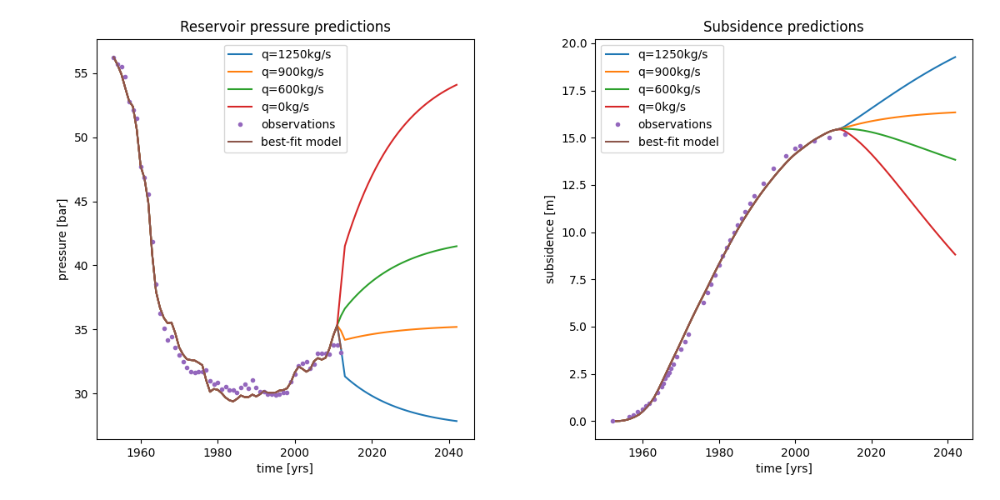

# Subsidence at Wairakei Geothermal Field
**Group 10**

Angela Guo • Anna Fu • Chelsea Mao • Freddie Ma • Theo Lim

<!-- ABOUT THE PROJECT -->
## About The Project

We have been tasked with creating a model to investigate the impact of increasing mass taken from the geothermal 
reservoir on Wairākei’s subsidence phenomenon, to provide evidence and suggestion to the decision making for Contact 
Energy Ltd’s consent application, considering possible outcomes.

<!-- GETTING STARTED -->
## Getting Started

### Required software
* Python 3.9+
* Text Editor for Python ([Visual Studio Code](https://code.visualstudio.com/) or 
[PyCharm](https://www.jetbrains.com/pycharm/))

Recommended
* [Anaconda](https://www.anaconda.com/)
* [Virtualenv](https://virtualenv.pypa.io/en/latest/installation.html)


### Installation

1. Clone the repo
    ```sh
    git clone 'https://github.com/aguo921/engsci263-group10'
    ```

2. (Recommended) Install virtual environment


4. Install required packages
   ```sh
   pip install -r requirements.txt
   ```

<!-- USAGE EXAMPLES -->
## Provided data
To support our study, Contact Energy Ltd has made the following data available to us:
* A `sb_mass.txt` file containing the extraction rate data from the Wairakei geothermal reservoir.
* A `sb_pres.txt` file containing the pressure monitoring data from the Wairakei geothermal reservoir.
* A `sb_disp.txt` file containing measurements of ground surface displacement taken at the centre of the Wairakei 
subsidence bowl.

## Usage

### Data visualisation
The `data_visualisation.py` file renders the given historical data.



### Numerical ODE solver
The `model_functions.py` file contains functions to solve the reservoir pressure and mudstone pressure numerically 
using the improved euler method.

### Unit testing
The `test_model_functions.py` file performs unit tests on the following functions from `model_functions.py`:
* `reservoir_ode`
* `mudstone_ode`
* `solve_reservoir_ode`
* `solve_mudstone_ode`

This is done by comparing the code results with the results from performing a few steps of the Improved Euler method 
by hand.

### Benchmarking
The `benchmark.py` file performs benchmarking, error analysis and timestep convergence.

**Reservoir pressure**



**Mudstone pressure**


**Subsidence**



### Model calibration
The `curve_fitting.py` file utilises the `curve_fit` function from the `scipy.optimize` library to calibrate the model 
to the given data, returning the best-fit parameters.

The `model_calibration.py` plots the reservoir pressure and subsidence solutions with the best-fit parameters.

**Best-fit model for reservoir pressure and subsidence**


The `model_calibration.py` also plots the misfits when the model is calibrated with vs without slow drainage.

**Pressure misfit without slow drainage**


**Pressure misfit with slow drainage**


### Forecasting
The `prediction.py` file performs forecasts 30 years into the future of the reservoir pressure and subsidence for four 
different possible outcomes:
* Increase mass take to the proposed value of 1250 kg/s.
* Keep mass take at the current value of 900 kg/s.
* Reduce mass take to a more stable level of 600 kg/s.
* Cease operations at the geothermal field entirely.



### Uncertainty analysis
