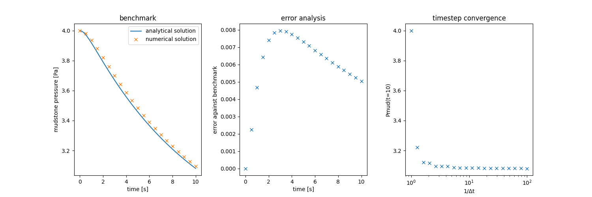
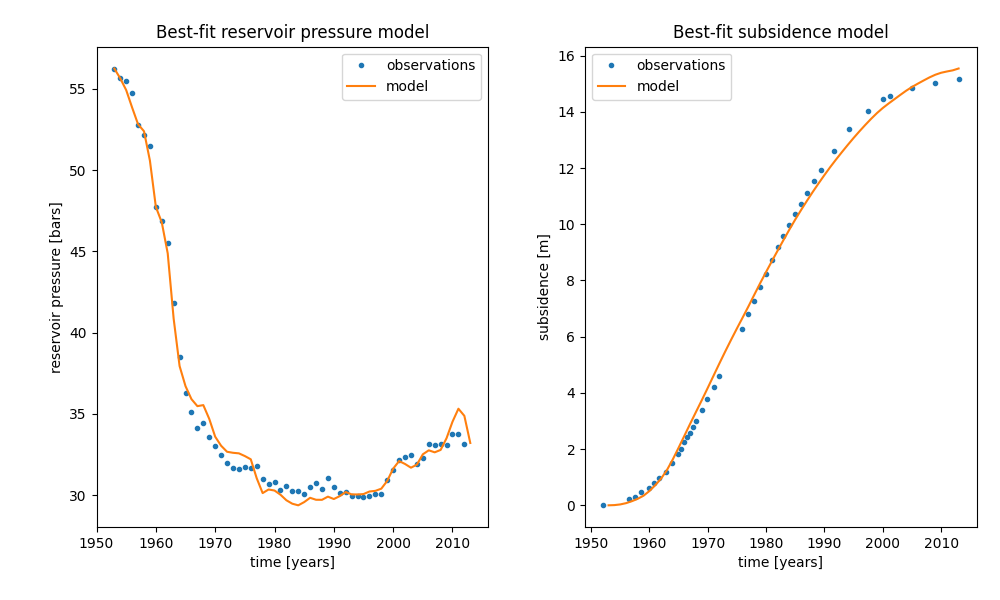
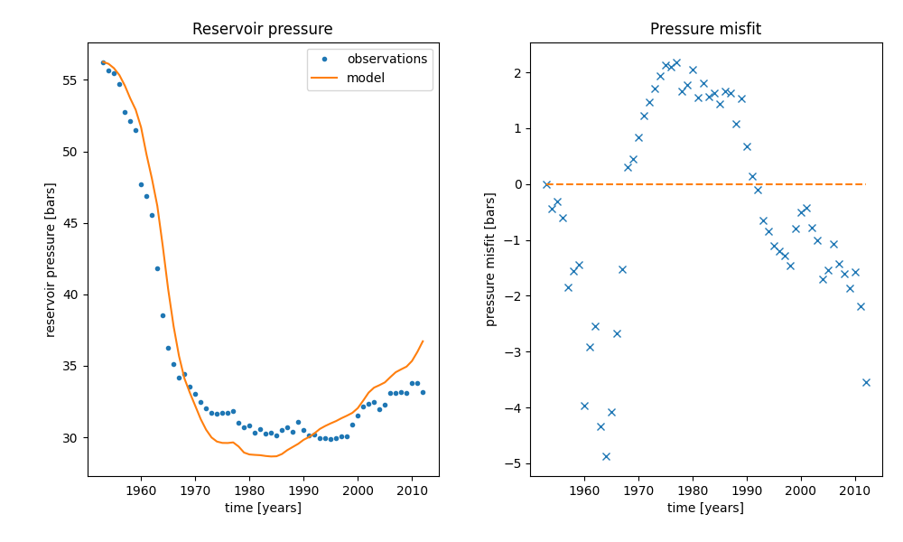
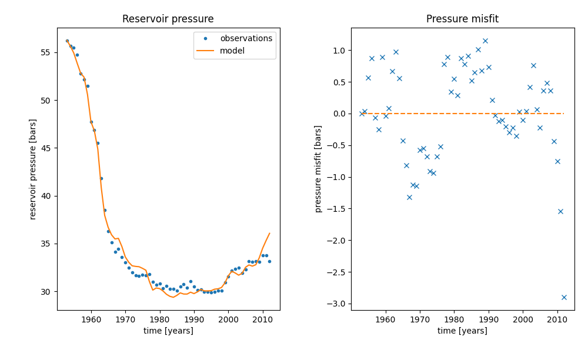

# Subsidence at Wairakei Geothermal Field
**Group 10**

Angela Guo • Anna Fu • Chelsea Mao • Freddie Ma • Theo Lim

<!-- ABOUT THE PROJECT -->
## About The Project

We have been tasked with creating a model to investigate the impact of increasing mass taken from the geothermal reservoir on Wairākei’s subsidence phenomenon, to provide evidence and suggestion to the decision making for Contact Energy Ltd’s consent application, considering possible outcomes.

<!-- GETTING STARTED -->
## Getting Started

### Required software

This is an example of how to list things you need to use the software and how to install them.
* Python 3.9+
* Text Editor for Python ([Visual Studio Code](https://code.visualstudio.com/) or [PyCharm](https://www.jetbrains.com/pycharm/))

Recommended
* [Anaconda](https://www.anaconda.com/)
* [Virtualenv](https://virtualenv.pypa.io/en/latest/installation.html)


### Installation

1. Clone the repo
```sh
git clone
```

3. (Recommended) Install and activate virtual environment
```sh
py -m venv env

.\env\Scripts\activate
```

4. Install required packages
  ```sh
  pip install -r requirements.txt
  ```

<!-- USAGE EXAMPLES -->
## Provided data
To support our study, Contact Energy Ltd has made the following data available to us:
* Extraction rate data from the Wairakei geothermal reservoir, located in `sb_mass.txt`.
* Pressure monitoring data from the Wairakei geothermal reservoir, located in `sb_pres.txt`.
* Measurements of ground surface displacement taken at the centre of the Wairakei subsidence bowl, located in `sb_disp.txt`.

## Usage

### Data visualisation
The `data_visualisation.py` file renders the given historical data.


### Numerical ODE solver
The `model_functions.py` file contains functions to solve the reservoir pressure and mudstone pressure numerically using the improved euler method.

### Unit testing
The `test_model_functions.py` file performs unit tests on the following functions from `model_functions.py`:
* `reservoir_ode`
* `mudstone_ode`
* `solve_reservoir_ode`
* `solve_mudstone_ode`

This is done by comparing the code results with the results from performing a few steps of the Improved Euler method by hand.

### Benchmarking
The `benchmark.py` file performs benchmarking, error analysis and timestep convergence.





### Model calibration
The `curve_fitting.py` file utilises the `curve_fit` function from the `scipy.optimize` library to calibrate the model to the given data, returning the best-fit parameters.

The `model_calibration.py` plots the reservoir pressure and subsidence solutions with the best-fit parameters.



The `model_calibration.py` also plots the misfits when the model is calibrated with vs without slow drainage.





### Forecasting
The `prediction.py` file performs forecasts 30 years into the future of the reservoir pressure and subsidence for four different possible outcomes:
* Increase mass take to the proposed value of 1250 kg/s.
* Keep mass take at the current value of 900 kg/s.
* Reduce mass take to a more stable level of 600 kg/s.
* Cease operations at the geothermal field entirely.


### Uncertainty analysis

Use this space to show useful examples of how a project can be used. Additional screenshots, code examples and demos work well in this space. You may also link to more resources.

_For more examples, please refer to the [Documentation](https://example.com)_


<!-- ACKNOWLEDGMENTS -->
## References

* []()
* []()
* []()
